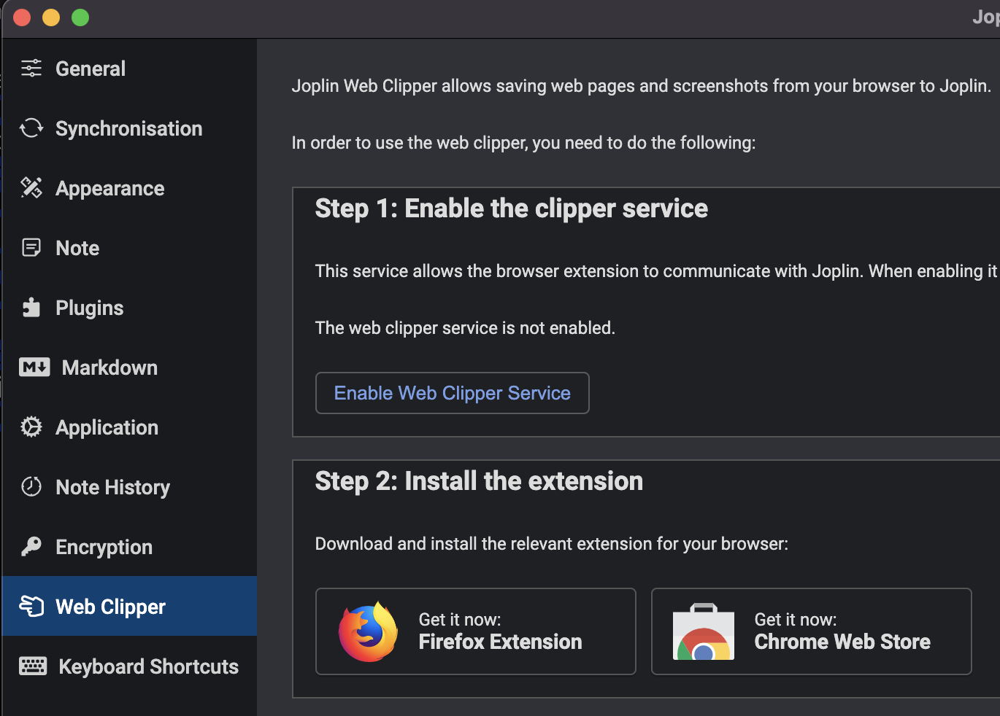

# Joplin Bulker - Bulk Operations for Joplin Notes
**Important**: This tool works with Joplin's **RAW Export Directory** format only - individual markdown files with metadata headers exported from Joplin. It does **not** work with Joplin's modern SQLite database format used by current versions.

The RAW export format creates a directory structure where each note, tag, and relationship is stored as a separate file with metadata headers. This tool parses these files to perform bulk operations like tag removal and Goodreads CSV imports.

*Note: The author has migrated to Obsidian and no longer maintains this project.*

## Installation

I have not published this package to PyPI, so you need to clone the repo and install it from sources:

    . ./activate.sh
    joplin-bulker --help

Note the first dot, it is important.

## Functions

### Bulk tag remover

Python script to bulk remove tags from [Joplin](https://joplinapp.org) files.

        joplin-bulker tag --rm=<tag name to remove>

## Usage

### Installation

To run the script you need [Python 3.10 or higher](https://www.python.org/getit/).

Install dependencies with

    . ./activate.sh

### Configuration

Specify the `folder` with your Joplin files in `config.yaml`.

For the Joplin API to work you should enable Joplin Web Clipper Service - in Joplin Desktop application open `Preferences`
and enable it in the `Web Clipper` section:

.

## Rationale

As discussed in the [Joplin forum](https://discourse.joplinapp.org/t/add-or-remove-tags-for-multiple-notes/4368/6),
the UI has no command for bulk tag removal.

There is [Joplin command line](https://joplinapp.org/terminal/) but I wanted simple
code in Python that I could easily modify for my purposes.

As a bonus, here we have Python code that can be
adjusted by anybody who prefers Python.
For example, it would be easy to filter by note title or to find all
dangling tags and so on.

## Implementation

We use [Joppy](https://github.com/marph91/joppy) to communicate with Joplin API.
